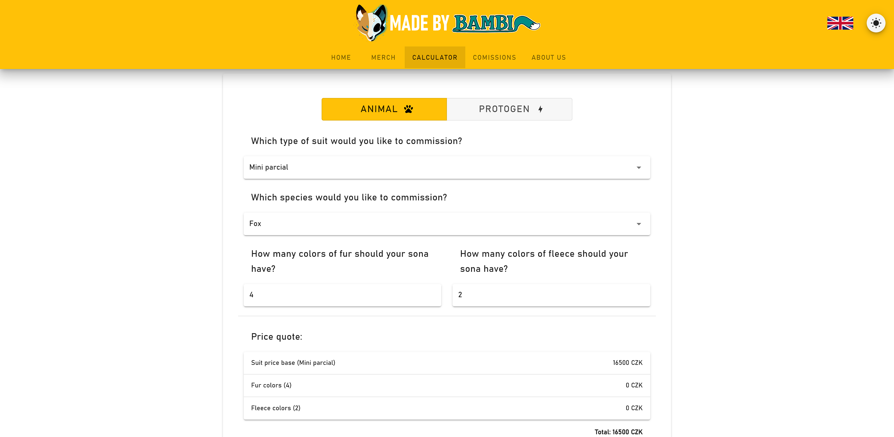
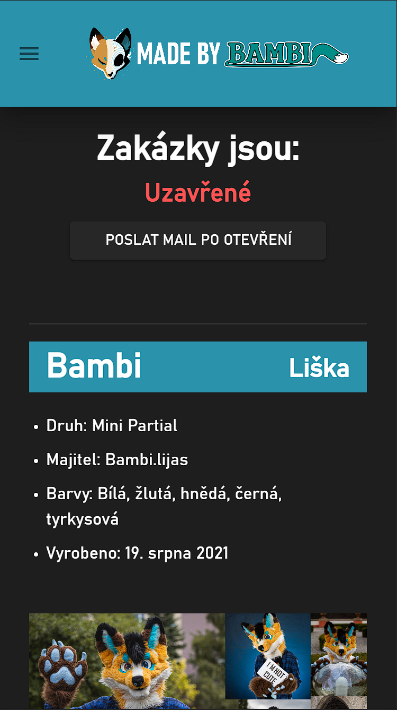
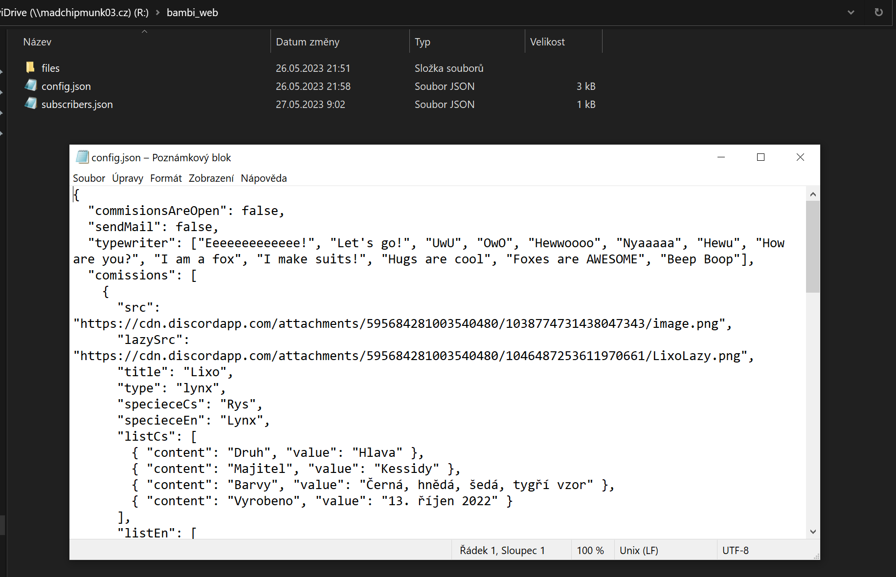

# <a href="https://madebybambi.com/#/">Personal website for Bambilijáš</a>

 

It is a personal website for bambilijáš made with vue.js. It's responsive, supports dark theme, multiple languages (czech/english) and can be configured through config file on shared drive.

   
   
   

